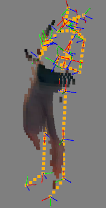
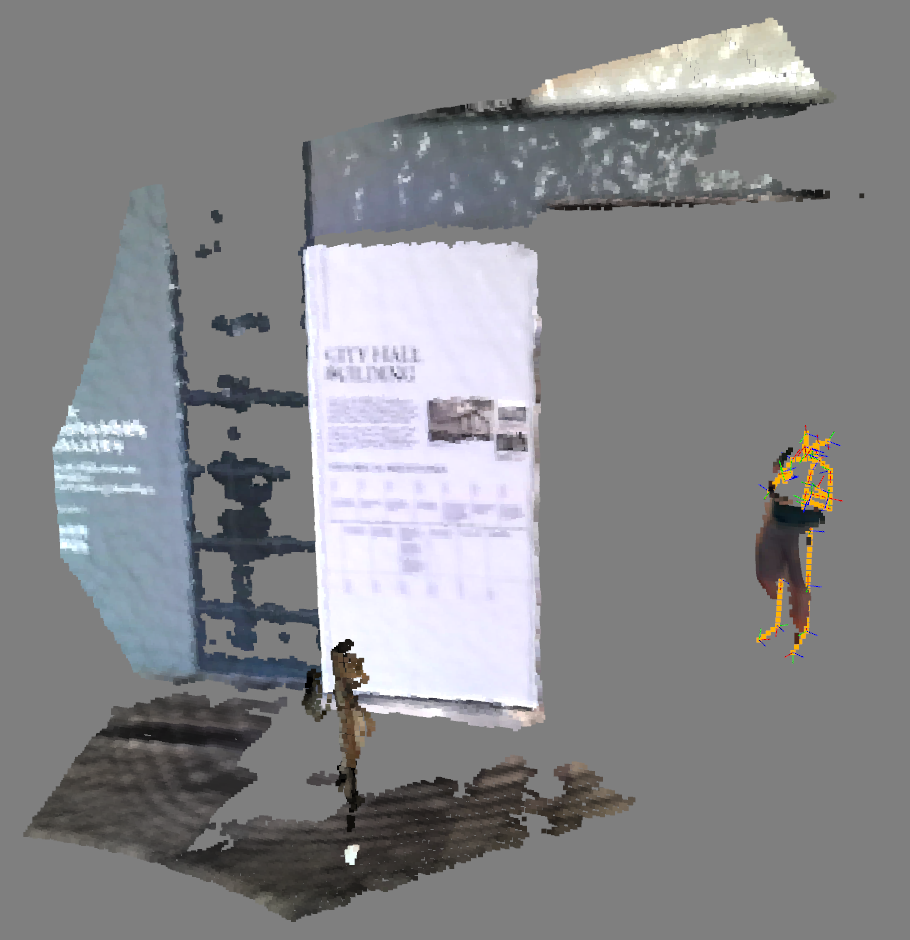
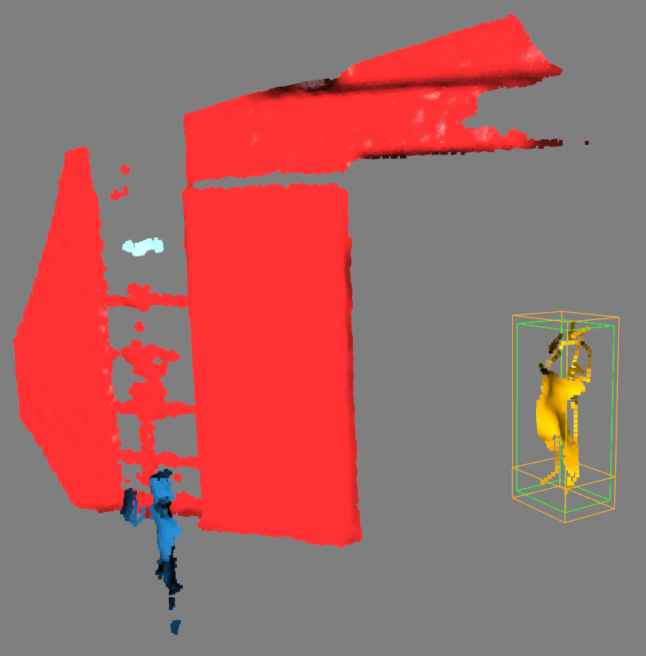
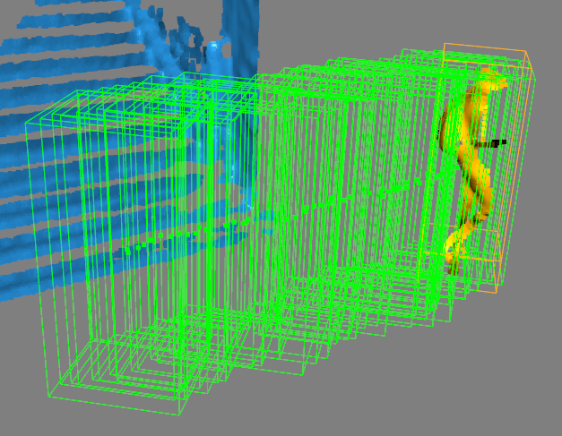
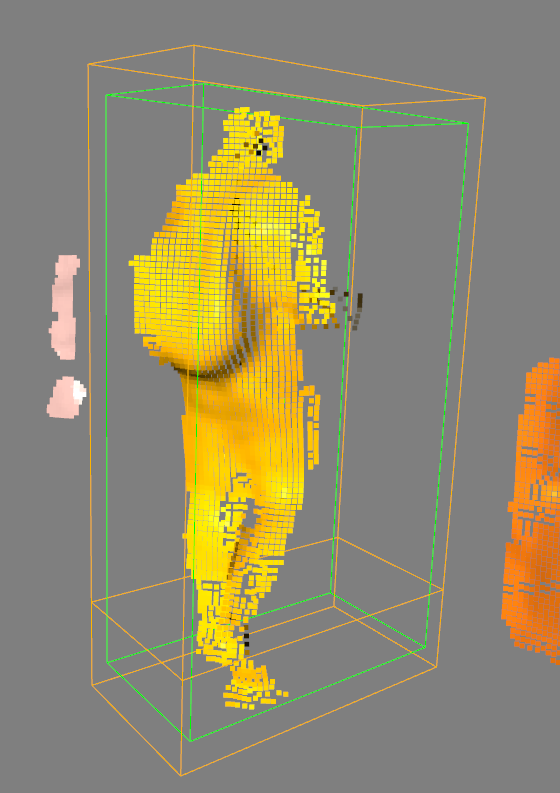

# Algorithm Overview
The main script `pcdproc` is used to read and process the pointcloud dataset based on Kinect 2 data with human skeleton detection, in order to remove the presence of the human body in the scene for cleaner map generation.

The main steps used to remove the human skeleton are as follows:

For every frame, consisting of a scene pointcloud with human points roughly removed, an optional pointcloud with those roughly removed human body points, optional detected human skeletons (with skeleton joints), and kinect 2 pose,

1. Recover the full scene pointcloud by merging the scene pointcloud and the optional human bodies pointcloud.
2. Remove points from full scene pointcloud whose normals are close to the vertical direction. The main purpose is to remove ground points, and create substantial separation amongst vertical objects.
3. If there are skeleton detections:
    
    * Generate a dense interpolated pointcloud for each detected skeleton that connecting the skeleton joints according to https://docs.microsoft.com/en-us/azure/kinect-dk/body-joints. The purpose is to use the skeleton pointcloud to connect different parts of the body pointcloud, so that these potentially disjoint parts from a single human body can robustly form a single cluster, thus generate a good bounding box that including all the points from the human body.
    * Perform clustering on the pointcloud with ground points removed and added dense skeleton points.
    * Identify the clusters corresponding to the skeletons, and generate their bounding boxes. If the bounding box is abnormally big for a human extent, indicating a clustering error, only the skeleton extent with a bit dialation is used.

| Dense interpolated skeleton pointcloud with the human body pointcloud parts | Scene pointcloud with densely interpolated skeleton | Clustered pointcloud with ground points removed |
|:-------------:|:-------------:|:-----:|
||||

4. Human cluster bounding boxes are used as input measurements to the `TrackManager`, to be tracked and temporarily smoothed. The motion of these tracks are using simple 3D constant velocity point motion model tracking the center of the bounding boxes, and the extent is "tracked" by simply taking the average extent of the last N measurements. A track is killed if it does not receive measurement updates for `TRACK_EXPIRE_GATE_TIME` seconds.

At the **full dataset sequence level**, we make sure about the following:

* The traces of the tracked bounding boxes are recorded. In batch processing mode, the sequence is processed **both forwardly in time, and backwardly in time**, so that non-detected humans partially in the sensor field of view may be recovered along both time directions.
* A human bounding box (being a predicted box with no measurement, or a posterior box if updated) is further split into **a top box** and **a bottom box**. We want to remove every point in the top box, but need to be more careful about the points in the bottom box so that we try not to remove the ground points with near to upright normals.
* For every pointcloud frame, all the human bounding boxes from the entire sequence is used to remove potential human points. The rationale is simply that once a space was occupied by a human, it is already dynamic thus should not be part of the map.

| Trace of tracked bounding boxes | Top and Bottom bounding boxes |
|:-------------:|:-------------:|
|||

# Dataset

An example dataset folder structure for data set `galleryP1`.
```
galleryP1
├── body
├── pcd
├── poses.csv
├── result
└── skeleton
```

|Subfolder / file|Description|
|:---|:---|
|body| Folder containing pointcloud pcd files of the pre-removed human bodies, in map frame.|
|pcd| Folder that containing scene pointcloud pcd files with human body points pre-removed (it doesn't affect anything if these pcd files are the full scene pointclouds) in map frame |
|poses.csv| CSV file with Kinect camera poses in map frame. |
|result| Folder created after running Batch Processing Mode, containing resultant scene pointcloud pcd files with fully removed human body points in map frame. |
|skeleton| Folder containing yaml files descriptions of kinect skeleton detections, expressed in Kinect camera frame. |


# Script usage

Below is the usage of the `pcdproc.py` main script.

```
usage: pcdproc.py [-h] [-b] [-s START] dataset

Human removal for Kinect 3D pointcloud sequence.

positional arguments:
  dataset               Path to dataset.

optional arguments:
  -h, --help            show this help message and exit
  -b, --batchmode       Batch processing mode (default debug-visualization mode).
  -s START, --start START
                        Start data frame serial number (default 0) in debug-visualization mode

```

Overall, there are two running mode of the script: 1. **debug and visualization mode (by default)**, and 2. **batch processing mode**.

## Debug/Vis Mode
In Debug/Vis Mode, an interactive visualization window is used to interact with the user and responding to user input to step through the dataset, and invoke data processing functions. Below is a table of inputs and their corresponding functions.

`./pcdproc.py data/galleryP1` by default runs Debug/Vis Mode, on `data/galleryP1` dataset.

|Key|Functionality|
|:---|:---|
|.|Go to the previous frame|
|,|Go to the next frame|
|/|Trigger data process and tracking function, and visualize the results|
|m|Show the resultant pointcloud frame with human removed if the resuls are generated in the `result` subfolder by running in the script on the dataset in Batch Processing Mode.|

## Batch Processing Mode

`./pcdproc.py -b data/galleryP1` runs the script in Batching Processing Mode, on `data/galleryP1` dataset.

It essentially scans through the dataset twice, once forward in time and once backward in time, to generate the human tracks and traces of bounding boxes. Then, these bounding boxes (top and bottom ones) are used to process every pointcloud frame to remove human points from. The results point clouds are stored in the `result` subfolder of the dataset.
